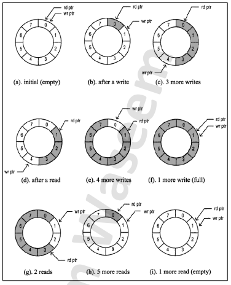

# FIFO Module

## Overview
This project involves designing a First-In-First-Out (FIFO) memory using Verilog and creating a testbench to verify its functionality. FIFO memory stores and retrieves data elements in the order they were added, utilizing two internal pointers (counters) to keep track of write and read positions within the memory.

## Inputs and Outputs

### Inputs
| Name   | Width      | Description                                           |
|--------|------------|-------------------------------------------------------|
| din_a  | FIFO_WIDTH | Write Data: The input data bus used when writing the FIFO. |
| wen_a  | 1          | Write Enable: If the FIFO is not full, asserting this signal causes data (on din_a) to be written into the FIFO. |
| ren_b  | 1          | Read Enable: If the FIFO is not empty, asserting this signal causes data (on dout_b) to be read from the FIFO. |
| clk_a  | 1          | Clock signal for port a, used in the writing operation. |
| clk_b  | 1          | Clock signal for port b, used in the reading operation. |
| rst    | 1          | Active high synchronous reset. It resets dout_b, internal write counter, and internal read counters. |

### Outputs
| Name    | Width      | Description                                           |
|---------|------------|-------------------------------------------------------|
| dout_b  | FIFO_WIDTH | Read Data: The output data bus used when reading from the FIFO. |
| full    | 1          | Full Flag: When asserted, this signal indicates that the FIFO is full. Write requests are ignored when the FIFO is full; initiating a write when the FIFO is full is not destructive to the contents of the FIFO. |
| empty   | 1          | Empty Flag: When asserted, this signal indicates that the FIFO is empty. Read requests are ignored when the FIFO is empty; initiating a read while empty is not destructive to the FIFO. |

## Parameters
| Name       | Default Value | Description                                |
|------------|---------------|--------------------------------------------|
| FIFO_WIDTH | 16            | Data in/out and memory word width.         |
| FIFO_DEPTH | 512           | Memory depth.                              |

## Schematic

## Functionality
The FIFO memory supports two main operations:
1. **Writing (Enqueuing) Data:** When `wen_a` is asserted and the FIFO is not full, data from `din_a` is written into the FIFO. The write pointer advances to the next position.
2. **Reading (Dequeuing) Data:** When `ren_b` is asserted and the FIFO is not empty, data from `dout_b` is read from the FIFO. The read pointer advances to the next position.

### Internal Mechanism
- **Write Pointer:** Advances when new data is written.
- **Read Pointer:** Advances when data is read.

### Reset Operation
- **Reset Signal (rst):** When asserted, it resets `dout_b`, the internal write counter, and the internal read counters to their initial states.

## Notes
- The FIFO module is designed to prevent write operations when the FIFO is full and read operations when the FIFO is empty, ensuring data integrity.

Feel free to add any additional details or modify the information as necessary!
